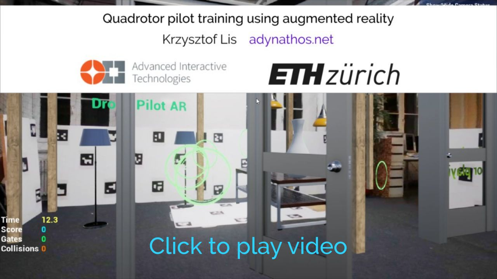

<h1>Augmented Unreality</h1>

Augmented Unreality is a plugin for <a href="https://www.unrealengine.com">Unreal Engine 4</a>
which enables creation of augmented reality applications by displaying a video stream from a camera 
inside the game and tracking camera position using fiducial markers.

It was created by <b>Krzysztof Lis (Adynathos)</b> as part of a project for <b>ETH Zürich</b>.

<h2>Features</h2>

<ul>
	<li>Video displayed in-game</li>
	<li>Camera position tracked using fiducial markers, multiple independent sets of markers can be tracked at once</li>
	<li>Editable spatial configurations of markers </li>
	<li>Camera calibration</li>	
	<li>Multiple video sources: cameras, video files, network streams. Source can be switched using in-game UI</li>
	<li>Shadow simulation (assuming the scene is on a plane)</li>
</ul>

<h2>Platforms</h2>
<ul>
<li>Windows</li>
<li>Linux</li>
<li>Android</li>
</ul>

<h2>Video Presentation</h2>
<figure>

</figure>

<h2 name="downloads">Downloads</h2>

<a href="https://github.com/adynathos/AugmentedUnreality/releases">Download Section</a>
<ul>
	<li><a name="downloads_plugin" href="https://github.com/adynathos/AugmentedUnreality/releases/download/1.2.02/AugmentedUnrealityPlugin_1_2_02.7z">Augmented Unreality Plugin</a>
		- the plugin files only, 
	</li>
	<li><a name="downloads_project" href="https://github.com/adynathos/AugmentedUnreality/releases/download/1.2.02/AugmentedUnrealityExampleProject_1_2_02.7z">Augmented Unreality Example Project</a>
		- an example project using the plugin
	</li> 
</ul>

<h2 name="install">Installation</h2>

<h3>Getting started - try the example project</h2>

<ul>
<li><a href="#downloads">Download the example project</a></li>
<li>Decompress the archive - and move <tt>AugmentedUnrealityEx</tt> to the location where you store your Unreal projects.</li>
<li>Launch Unreal Engine and open <tt>AugmentedUnrealityEx/AugmentedUnrealityEx.uproject</tt>.</li>
<li>Print the following boards:
<a href="http://adynathos.net/dev/aur/ChArUco_20_C.png">Chessboard 1</a>, <a href="http://adynathos.net/dev/aur/ChArUco_26_C.png">Chessboard 2</a>, <a href="http://adynathos.net/dev/aur/AURBoard_SquareB.png">Square B</a>
</li>
<li>Connect a camera and launch the game.</li>
<li>If the virtual object are not well aligned with the markers, perform <a href="#section_calibration">camera calibration</a>.</li>
</ul>

<figure>
<figcaption> Overview of elements visible in the example project: </figcaption>
	<!---->
	
</figure>

<h3>Add plugin to an existing project:</h3>

<ul>
<li><a href="#downloads">Download the plugin</a></li>
<li>Decompress the archive - and move directory <tt>AugmentedUnreality</tt> to <tt>YourProject/Plugins</tt></li>
<li>Reopen your project</li>
<li>Add to your level: <tt>AURCameraActor</tt> to show the video and one of the <a href="boards">fiducial patterns</a>: <tt>PatternChessboard_A</tt>, <tt>PatternChessboard_B</tt>,  <tt>PatternCube</tt>, <tt>PatternSquare_A</tt>, <tt>PatternSquare_B</tt></li>
<li>Add a shadow plane actor if you want shadows cast on the surface under the markers</li>
<li>Run the game to generate pattern images. Then print the patterns from <tt>YourProject/Saved/AugmentedUnreality/Patterns</tt>
</ul>

<h2 name="video">Camera / Video sources</h2>

The plugin tries to detect what video sources are available depending on the platform:
<ul>
	<li>Android - the device camera will be used, available resolutions determined using the camera API</li>
	<li>Windows, Linux - video acquisition is achieved using OpenCV's <a href="http://docs.opencv.org/3.2.0/d8/dfe/classcv_1_1VideoCapture.html">VideoCapture</a>.
	Standard resolutions are offered, but there is no guarantee that the camera can output in all resolutions.</li>
	<li>Video files: <tt>AURVideoVideoFile</tt>. The <tt>VideoFile</tt> should be the path to the file relative to <tt>FPaths::GameDir()</tt>.
		GStreamer needs to be installed to play videos.
	</li>
	<li><tt>AURVideoSourceStream</tt> - video streamed through network. Set only one of the following:
		<ul>
			<li><tt>ConnectionString</tt> - a <a href="http://www.z25.org/static/_rd_/videostreaming_intro_plab/">GStreamer pipeline</a> ending with appsink.</li>
			<li><tt>StreamFile</tt> - path to a </tt>.sdp</tt> file relative to <tt>FPaths::GameDir()</tt>.</li>
		</ul>
	</li>
	<li>Test video - changes color every second</li>
</ul>

Select the video source from the menu on the right.

The <tt>CalibrationFileName</tt> is the location of the file storing calibration for this video source, relative to <tt>FPaths::GameSavedDir()/AugmentedUnreality/Calibration</tt>.
If two sources use the same camera, they should have the same calibration file.

<h3 name="calibration">Camera calibration</h3>

Best quality is obtained if the camera is calibrated. 
It is important to find the camera's <b>field of view</b>.
If the camera's field of view differs from the rendering engine's field of view,
the virtual objects will not be properly aligned to the real world.
If you notice that the virtual objects move in real world when you move the camera, it means the camera is not correctly calibrated

Each <tt>VideoSource</tt> can have different camera parameters, therefore each has its own calibration file
located at located in <tt>FPaths::GameSavedDir()/AugmentedUnreality/VideoSource.CalibrationFilePath</tt>.
The driver will attempt to load this file and display the information whether the camera is calibrated in the UI.

To perform calibration of your camera:
<ul>
<li>Print or display on an additional screen the calibration pattern found in <tt>AugmentedUnreality/Content/Calibration/calibration_pattern_asymmetric_circles.png</tt></li>
<li>Open the example project and start the game</li>
<li>In the menu in the top-right corner of the screen, choose the right video source and click <tt>Calibrate</tt></li>
<li>Point the camera at the calibration pattern from different directions - pattern is detected if a <a href="#fig_calibration">colorful overlay is drawn</a></li>
<li>Wait until the progress bar is full</li>
<li>The camera properties are now saved to the calibraiton file and will be loaded whenever you use this video source again</li>
</ul>

<figure name="fig_calibration">
	<figcaption>Camera calibration in progress - the colorful overlay indicates the calibration pattern was detected:<figcaption>
	<!---->
	
</figure>

<h2 name="tracking">Tracking</h2>

This plugin uses <a href="http://www.uco.es/investiga/grupos/ava/node/26">ArUco</a> boards for camera pose estimation,
specifically the <a href="http://docs.opencv.org/3.2.0/d5/dae/tutorial_aruco_detection.html">implementation of ArUco in OpenCV contrib</a>.

Boards are used for two purposes:
<ul>
	<li>Positioning the camera in game world - this aligns the real and virtual world.
		The board's position in real world is equivalent to the point (0, 0, 0) in game world.
		Boards used for camera positioning are set in the <tt>PlayerController</tt>'s <tt>MarkerBoardDefinitions</tt>
		property (if you are extending the example player controller)
		or in <tt>AURCameraActor</tt>'s <tt>BoardDefinitions</tt> if you are spawning the camera actor directly.
	</li>
	<li>
		Positioning independent actors - to bind an actor's pose to an AR board,
		add an <tt>AURTrackingComponent</tt> to the actor and select the <tt>ChildActorClass</tt> to one of the board blueprints
	</li>
</ul>

<h3 name="boards">Boards</h3>
<figure>
	<!---->
	
</figure>

An ArUco board is a set of square markers, together with their positions and orientations in space.
When a board is visible in the video, its pose relative to the camera can be calculated.
In Augmented Unreality, we use boards for finding the pose of the camera in game world and for positioning independent actors with their own markers.

Augmented Unreality allows the user to create their own custom spatial configurations of markers in Unreal Editor.
Please see the example boards in <tt>AugmentedUnreality/Content/Patterns</tt> and <tt>AugmentedUnrealityEx/Content/AugmentedUnrealityExample/Patterns</tt>.

<ul>
	<li><a href="http://docs.opencv.org/3.2.0/d5/dae/tutorial_aruco_detection.html">ArUco</a> - markers can be arranged into any spatial configuration.
	Use <tt>PatternCube</tt>, <tt>PatternSquare_A</tt>, <tt>PatternSquare_B</tt> or subclass <tt>AURFiducialPatternSpatialBP</tt>. </li>

	<li><a href="http://docs.opencv.org/3.2.0/df/d4a/tutorial_charuco_detection.html">ChArUco</a> boards - markers are combined with a chessboard grid. More accurate tracking but must be on a plane. Use <tt>PatternChessboard_A</tt>, <tt>PatternChessboard_B</tt> or subclass <tt>AURFiducialPatternFlatBoardBP</tt>.</li>
</ul>

<h4 name="custom_boards">Custom boards</h4>

To design a new board, create a child blueprint of <tt>AURFiducialPatternSpatialBP</tt> and edit it by adding <tt>AURMarkerComponents</tt> inside it.
Each <tt>AURMarkerComponent</tt> represents one square on the board.
<ul>
	<li><tt>Location</tt>, <tt>Rotation</tt> - pose of square in space. You can use <tt>SceneCompoenent</tt>s to organize the board hierarchically.</li>
	<li><tt>Id</tt> - identifier of the pattern shown in this square. Each square should have a different Id.</li>
	<li><tt>BoardSizeCm</tt> - length of the square's size. This will automatically set the scale.
		When printing the boards, please ensure the squares match this size.</li>
	<li><tt>MarginCm</tt> - margin inside the square, does not affect the total size.</li>
</ul>
If you want to use the board to position the (0, 0, 0) point, add to to <tt>MarkerBoardDefinitions</tt> in <tt>PlayerController</tt>.
If you want an actor to follow the position of the board, add an <tt>AURTrackingComponent</tt> to the actor and select the <tt>ChildActorClass</tt> to the board blueprint.

After you create or edit the board blueprint, launch the game to generate the marker images.
Then open the directory <tt>YourProject/Saved/AugmentedUnreality/Patterns/YourBoardName</tt>, print the images,
and arrange them in space to match your designed configuration.
The IDs of the markers in the editor need to match the numbers present in the images:

<figure>
	<!---->
	
</figure>

<figure>
	<!---->
	
</figure>

<h3 name="solutions">Education</h3>

The following problems have been solved in this plugin,
if you want to learn about these topics, please see:
<ul>
<li>
<a href="https://github.com/adynathos/AugmentedUnreality/blob/master/Source/AugmentedUnreality/AugmentedUnrealityAndroid_UPL.xml">Accessing Android's camera video in UE</a>
</li>
<li>
<a href="https://github.com/adynathos/AugmentedUnreality/blob/master/Source/AugmentedUnreality/AugmentedUnreality.Build.cs">Including external libraries in UE4</a>
</li>
<li>Multi-threading in UE4 
<a href="https://github.com/adynathos/AugmentedUnreality/blob/master/Source/AugmentedUnreality/AURDriverThreaded.h">(1)</a>
<a href="https://github.com/adynathos/AugmentedUnreality/blob/master/Source/AugmentedUnreality/AURDriverThreaded.cpp">(2)</a>
<a href="https://github.com/adynathos/AugmentedUnreality/blob/master/Source/AugmentedUnreality/AURDriverOpenCV.h">(3)</a>
<a href="https://github.com/adynathos/AugmentedUnreality/blob/master/Source/AugmentedUnreality/AURDriverOpenCV.h">(4)</a>
</li>
<li>Performing OpenCV camera calibration
<a href="http://docs.opencv.org/3.1.0/d4/d94/tutorial_camera_calibration.html">OpenCV tutorial</a>, 
<a href="https://github.com/adynathos/AugmentedUnreality/blob/master/Source/AugmentedUnreality/AUROpenCVCalibration.cpp">adaptation for the plugin</a>
</li>
<li> Drawing on dynamic textures
	<a href="https://wiki.unrealengine.com/Dynamic_Textures">UE tutorial</a> (a bit old)
	<a href="https://github.com/adynathos/AugmentedUnreality/blob/master/Source/AugmentedUnreality/AURVideoScreenBase.cpp">my adaptation</a>
</li>
<li>
<a href="https://github.com/adynathos/AugmentedUnreality/blob/master/Source/AugmentedUnreality/tracking/AURArucoTracker.cpp">Conversion between OpenCV's and Unreal's coordinate systems</a>
</li>
</ul>

